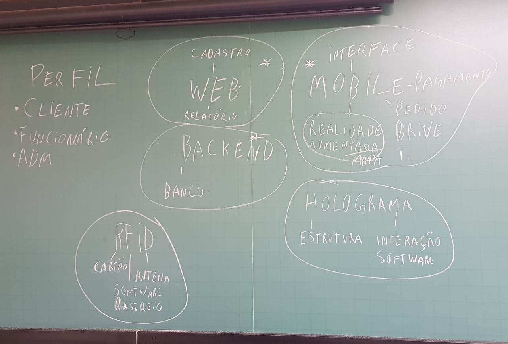

# **A Mudança de como fazer compras.**

Mercado Inteligente consiste na evolução do que temos hoje como mercado, 
visando a melhora da qualidade de como se fazer compras comuns na era atual,
utilizando da prática de sistema distribuído, para desenvolver módulos que iram 
atendender determinados requisitos e que poderam ser escalaveis conforme a necessidade e crescimentos,
por parte dos usuários, desejamos atender a eles de forma agil, disponibilizando ferramentas de procura
de produtos por realidade aumentada, e o aumento do informativo de produtos, facilitando a forma de pagamento entre outros que possam facilitar o uso dos mesmos, por parte da gerencia do local, será a criação de um sistema de gerenciamento, I.A para analise do que está ocorrendo
no local, mapeamento dos produtos, mapeamento dos carrinhos, segurança automatizada e outros modulos.

